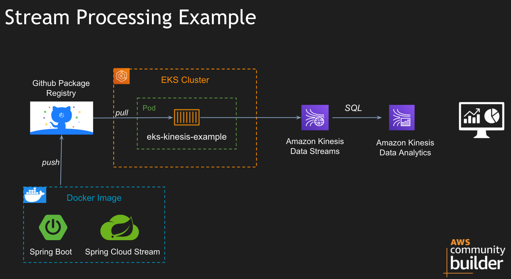

# Stream Processing Example
Stream processing example using Spring Boot, Spring Cloud Stream Binder Kinesis, Kinesis Data Streams and Kinesis Data Analytics.

## Architecture


## Commands
- Create EKS Cluster
```
eksctl create cluster --name tp-cluster-1 --nodes 2 --node-type t3.small --managed --region us-east-1
```
- Building the Docker Image and push to Github Package Registry
```
./mvnw clean package
docker build . -t eks-kinesis-example:v1
docker tag eks-kinesis-example:v1 docker.pkg.github.com/techprimers/container-images/eks-kinesis-example:v1
docker push docker.pkg.github.com/techprimers/container-images/eks-kinesis-example:v1
```
- Once EKS Cluster is UP, deploy the containers
```
kubectl apply -f eks-kinesis-example/k8s.yml
kubectl get pod -w
```
- Create the image pull secret
```
kubectl create secret docker-registry registry-secret --docker-server=docker.pkg.github.com --docker-username=<username> --docker-password=<token>
```

## References
- [Getting started with eksctl](https://docs.aws.amazon.com/eks/latest/userguide/getting-started-eksctl.html)
- [Amazon Kinesis Sample](https://dataflow.spring.io/docs/recipes/kinesis/simple-producer-consumer/)
- [Github Package registry - container-images](https://github.com/TechPrimers/container-images)
